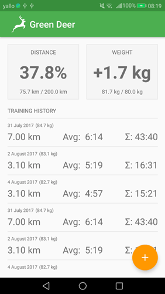
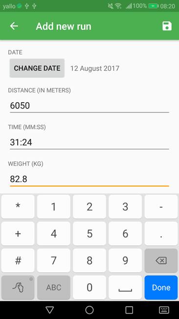

# Green Deer

An application to track the distances your cover while running. Created as a playground for various Android APIs and to learn using Google Protocol Buffers and gRPCs. You can find the gRPC server implementation [here](https://github.com/kantoniak/green-deer-server).

  
  

I started this app as a side project during HackZurich 2017 to set up Protocol Buffers for our project. I hope to continue someday to check out other nice features of Android. Feel free to fork if you contact me first.

## What is done

* Proto definitions for all the types
* Listing the tracks straight from the server
* Adding a new task in a new activity

### Interesting things I learned about

* Multithreaded cooperation between different tasks
* Using gradle
* Writing custom components
* Fragments' lifecycles

## TODOs

* Better handling of errors while adding an entry
* Editing and deleting an entry (after long-press on entry)
* Saving tasks locally and then syncing using SyncProvider

## Why Green Deer?

It's from a codename generator. [This one](http://www.fantasynamegenerators.com/code-names.php) is nice.